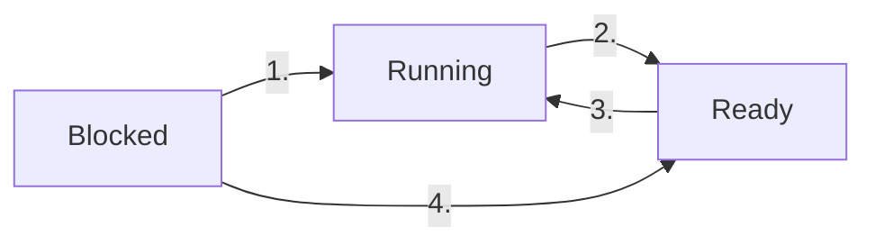

# Process Management

## TF-IDFC

- process model: 2
- process states: 2
- process heirchary: 1
- scheduling algorithms: 14
- process and threads: 7
- why threads better: 3
- real time scheduling: 1
- context switching: 1
- process control block: 1
- dining philosopher problem: 2

## Key Notes

- process is an abstraction of a running program
- in multiprogramming system, cpu switches from process to process quickly

### Process Model

- in this model, all runnable software (including os) is organized into a number of sequential processes
- Process: instance of running program including current values of pc, registers, and variables
  - conceptually each process has its own virtual cpu
  - program, input, output, state
  - 

### Process Creation

- four principle event that cause process creation
  - system initialization
    - when os is booted, several processes are created, some foreground, some background processes (daemons)
  - running process calls process creation system call
  - user requests to create a new process
  - initiation of batch jobs (only in batch system)

- in all 4 mentioned cases, processes are created by an already existing process through system call

### Process Termination

- Methods of Process Termination
  - Normal exit (voluntary)
  - Error exit (voluntary)
  - Fatal error (involuntary)
  - Killed by another process (involuntary)
  
### Process Hierarchies

- child process (process created by another process) and parent process (process that created the child process) continue to be associated (in some system)
- the child can itself create more process forming a heirarchy
- in UNIX, a process, its children and all other decendents form a process group

### Process States

- a process may be in one of the three states
  - Running (using cpu currently)
  - Ready (runnable, another process using cpu)
  - Blocked (unable to run until external event happens)



```
1. Process blocks for input
2. Scheduler picks another process to run
3. Scheduler picks this process
4. Input becomes available

```

### Implementation of Processes

- os maintains a table called process table (process control blocks) with one entry per process
- each entry contains information about process' state:
  - program counter
  - stack pointer
  - memory allocations
  - status of open files
  - accounting and scheduling information
  - everything else that must be saved when context switching

Example

| Process Management | Memory Management | File Management |
| ------------------ | ----------------- | --------------- |
| Registers | Pointer to text segment info | Root Directory |
| Program Counter | Pointer to data segment info | Working Directory |
| Program Status word | Pointer to stack segment info | File descriptors |
| Stack Pointer | | User ID |
| Process State | | Group ID |
| Priority | | |
| Scheduling Parameters | | |
| Process ID | | |
| Parent Group | | |
| Parent Process | | |
| Signals | | |
| Time when process started | | |
| CPU time used | | |
| Children's CPU time | | |
| Time of next alarm | | |

#### When interrupt occurs

1. Hardware stacks program counter, etc.
2. Hardware loads new program counter from interrupt vector
3. Assembly language procedure saves registers
4. Assembly language procedure sets up new stack
5. C interrupt service runs
6. Scheduler decides which process to run next
7. C procedure returns to the assembly code
8. Assembly language procedure starts up new current process

### Multiprogramming Modeling

- CPU utilization = $1 - p^n$
- Where
  - p = fraction of process' time it waits for an I/O
  - n = no of processes in memory at a time

### Threads

- process within a process, for mutiple threads of control in same address space
- Why Threads?
  - simpler programming model for applications that needs to do multiple things at the same time
  - easier and faster to create and destroy than processes
  - preformance (specially on system with multiple cpus)

### The Classical Thread Model

- Process model is based on two independent concepts
  - resource grouping: keeping related resource (program text, data, open files etc.) together
  - execution: process has a thread of execution (*thread*) containing a program counter, registers, stack

  - | Per process items | Per thread items |
    | ----------------- | ---------------- |
    | Address space | Program counter |
    | Global variables | Register |
    | Open files | Stack |
    | Child processes | State |
    | Pending alarms | |
    | Signals and signal handlers | |
    | Accounting information | |

- Threads are the actual entities scheduled for execution on the CPU.
- threads share address space and other resources

### POSIX Threads

- Each Pthreads thread has an identifier, a set of registers (pc included), set of attributes (stored in a structure)
  - attributes include stack size, scheduling parameters, other items needed to use thread
- Pthreads function calls

  - | Thread call | Description |
     | ----------- | ----------- |
     | Pthread_create | Create a new thread |
     | Pthread_exit | Terminate the calling thread |
     | Pthread_join | Wait for a specific thread to exit |
     | Pthread_yield | Release the CPU to let another thread run |
     | Pthread_attr_init | Create and initalize a thread's attribute structure |
     | Pthread_arrt_destroy | Remove a thread's attribute structure |

### Threads in User Space

- from kernel's pov, its managing single threded processes.

- **Advantages:**
  - can be inplemented on system that does not support threads
- **Disdavantages:**
