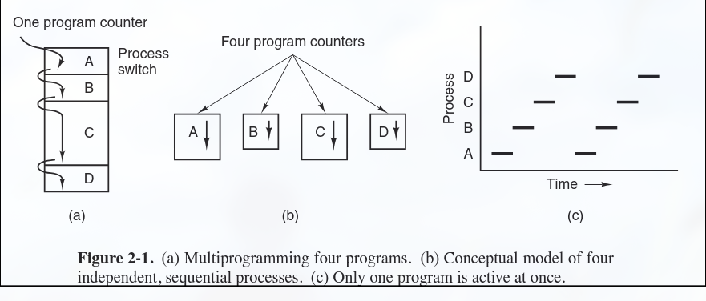

# Process Management

## TF-IDFC

- process model: 2
- process states: 2
- process heirchary: 1
- scheduling algorithms: 14
- process and threads: 7
- why threads better: 3
- real time scheduling: 1
- context switching: 1
- process control block: 1
- dining philosopher problem: 2

## Key Notes

- process is an abstraction of a running program
- in multiprogramming system, cpu switches from process to process quickly

### Process Model

- in this model, all runnable software (including os) is organized into a number of sequential processes
- Process: instance of running program including current values of pc, registers, and variables
  - conceptually each process has its own virtual cpu
  - program, input, output, state
  - 

### Process Creation

- four principle event that cause process creation
  - system initialization
    - when os is booted, several processes are created, some foreground, some background processes (daemons)
  - running process calls process creation system call
  - user requests to create a new process
  - initiation of batch jobs (only in batch system)

- in all 4 mentioned cases, processes are created by an already existing process through system call

### Process Termination

- Methods of Process Termination
  - Normal exit (voluntary)
  - Error exit (voluntary)
  - Fatal error (involuntary)
  - Killed by another process (involuntary)
  
### Process Hierarchies

- child process (process created by another process) and parent process (process that created the child process) continue to be associated (in some system)
- the child can itself create more process forming a heirarchy
- in UNIX, a process, its children and all other decendents form a process group

### Process States

- a process may be in one of the three states
  - Running (using cpu currently)
  - Ready (runnable, another process using cpu)
  - Blocked (unable to run until external event happens)


1. Process blocks for input
2. Scheduler picks another process to run
3. Scheduler picks this process
4. Input becomes available

```
```
